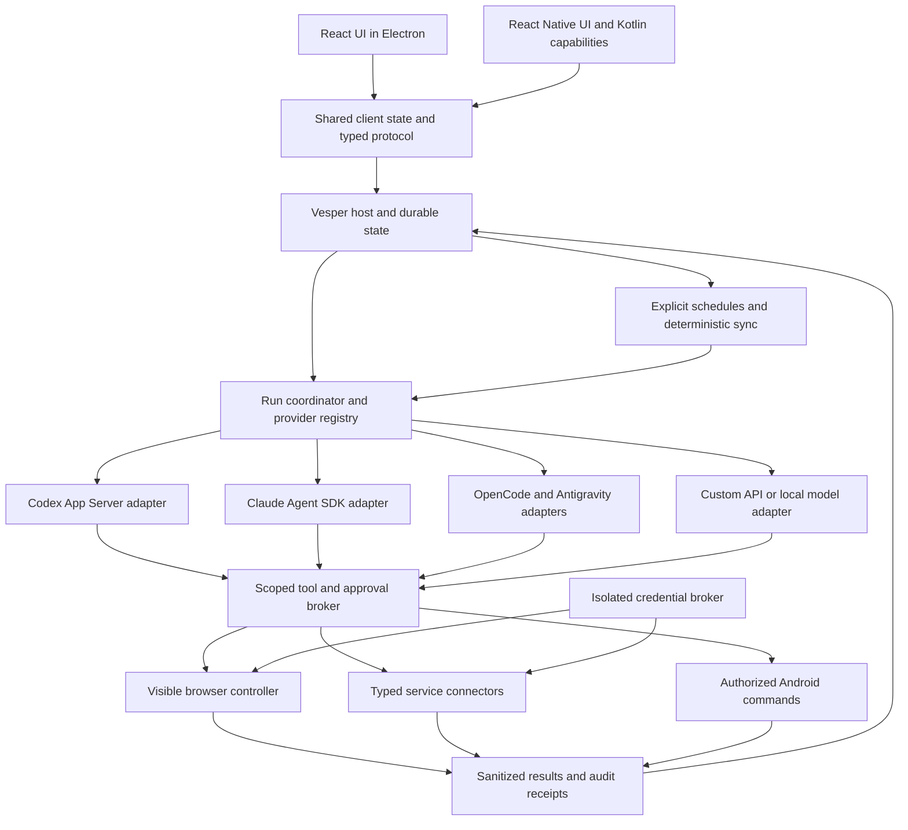

# Architecture and concrete reuse

Vesper is its own product, assembled from existing packages and selected source code. It is not a small fork of T3, OpenClaw, or another whole application. The user explicitly clarified this on September 26, 2026. Preserve the Muse UX target while reusing the engineering underneath it.

This document supersedes any overly broad reading of the initial technology shortlist. Source inspection establishes candidates and constraints. Except for the Croner experiment below, the candidate code was not executed or security-audited. Source tests were read, not run.

## Recommended ownership boundaries

### Direct evidence from Muse

Meta's [September 2026 engineering write-up](https://security.muse.ai/) describes a dedicated Linux VM, an unprivileged runtime cell, separate credential and connector services, a permission authority called Sentinel, and durable Postgres state. It inserts real API secrets at the network boundary using surrogate credentials. Its external browser broker exposes accessibility snapshots, prohibits agent JavaScript/devtools access, and pauses agent control during credential filling and user takeover. These details support Vesper's separation of execution, permissions and secrets; they do not prove a local Electron app alone offers equivalent isolation.

Meta's [design account](https://introducing.muse.ai/) explains persistent main chat, side chats, interruptible work, editable memory, deterministic approval UI and artifacts. Vesper preserves those interaction goals while intentionally changing the proactivity policy.

Vesper design judgment: offer a local host first with an enforced execution sandbox, and preserve a compatible self-hosted Linux runner mode for unattended availability and stronger separation. The host can stay reachable without waking an LLM. Do not promise Muse-equivalent isolation until broker and sandbox escape tests pass. Do not attempt to recreate Meta's classifier ensemble or kernel taint tracking as a prerequisite for the initial product; use explicit constrained capabilities and truthful limits.

The UI does not execute connector writes. Provider adapters do not own browser profiles or credentials. The host owns canonical conversation and task state, while each harness owns its native session. Tool permissions survive changing the model because the broker enforces them outside the model.

Separate three things often conflated in agent projects:

1. The model provider supplies inference and account limits.
2. The harness manages a model's loop, context, native tools and sessions.
3. Vesper supplies personal-service capabilities, the shared browser, approval records and the product's durable state.

Do not put a second planner around Codex or Claude for every action. Those harnesses already run an agent loop. Give each a small Vesper tool interface, normalize its events, and let deterministic services do sync/scheduling/ranking. A custom bare-model adapter needs a Vesper-owned loop; that does not mean every harness must use it.

## What to take from T3 first

All T3 paths below refer to commit `ab099178a7b7f9728843e90fc95ed90bb61d710d`, root license MIT. Links are pinned so future agents can inspect the exact reference. Keep the upstream license and attribution when adapting code.

| Component | Specific source | Reuse decision | Work avoided and changes required |
| --- | --- | --- | --- |
| Codex protocol client | [packages/effect-codex-app-server](https://github.com/pingdotgg/t3code/tree/ab099178a7b7f9728843e90fc95ed90bb61d710d/packages/effect-codex-app-server) | Strong extraction candidate, include tests and generation scripts | Typed request/response handling, server notifications, bidirectional requests and child-stdio lifecycle. Private workspace package, not an assumed npm install. About 2,722 handwritten lines including tests and 58,004 generated lines. |
| ACP protocol client | [packages/effect-acp](https://github.com/pingdotgg/t3code/tree/ab099178a7b7f9728843e90fc95ed90bb61d710d/packages/effect-acp) | Strong extraction candidate if matching Effect is chosen | Capability negotiation, sessions, streaming, permissions, termination handling. About 4,697 handwritten and 10,410 generated lines. Compare official ACP SDK before committing to this dependency. |
| Adapter contract | [ProviderAdapter.ts](https://github.com/pingdotgg/t3code/blob/ab099178a7b7f9728843e90fc95ed90bb61d710d/apps/server/src/provider/Services/ProviderAdapter.ts) | Adapt the interface and capability semantics | Start/send/interrupt/stop, approval/user-input responses, model switching, compaction and rollback support. Replace coding-thread assumptions with Vesper runs and canonical chat IDs. |
| Claude integration | [Layers/ClaudeAdapter.ts](https://github.com/pingdotgg/t3code/blob/ab099178a7b7f9728843e90fc95ed90bb61d710d/apps/server/src/provider/Layers/ClaudeAdapter.ts) and its test file | Selective extraction around official SDK, not entire adapter | SDK query, event/permission normalization, interruption and usage handling. The file alone is 5,577 lines and imports T3 contracts, settings, checkpoint/session and runtime services. |
| Codex/OpenCode adapters | [Layers directory](https://github.com/pingdotgg/t3code/tree/ab099178a7b7f9728843e90fc95ed90bb61d710d/apps/server/src/provider/Layers) | Adapt provider-specific behavior and tests | CodexAdapter is 2,755 lines, OpenCodeAdapter 4,048. Native protocol edge cases are valuable; full imports would drag in the coding product. |
| Antigravity translation | [AntigravityProtocol.ts](https://github.com/pingdotgg/t3code/blob/ab099178a7b7f9728843e90fc95ed90bb61d710d/apps/server/src/provider/acp/AntigravityProtocol.ts) and `AntigravityProtocol.test.ts` | Good bounded extraction candidate | Distinguishes native user questions from permission requests and maps actual option IDs. Preserve this distinction; an answer choice is not an approval. Replace T3-specific artifact/path types. |
| Browser profiles | [BrowserSession.ts](https://github.com/pingdotgg/t3code/blob/ab099178a7b7f9728843e90fc95ed90bb61d710d/apps/desktop/src/preview/BrowserSession.ts) and `BrowserSession.test.ts` | Adapt selected functions and tests | Deterministic account partition names, persistent/ephemeral sessions and scoped storage clearing. A 270-line file with tests for scope collisions and error handling. Replace permission defaults and product namespace. |
| Browser control | [preview/Manager.ts](https://github.com/pingdotgg/t3code/blob/ab099178a7b7f9728843e90fc95ed90bb61d710d/apps/desktop/src/preview/Manager.ts), `PlaywrightInjectedRuntime.ts`, `GuestProtocol.ts` | Split into narrow reusable functions after a spike | Navigation, active tabs, interactions and inspection. Manager is 5,156 lines; do not bring every picker, PR annotation, recording and developer-preview concern. |
| Cross-client state | [packages/client-runtime/src/connection](https://github.com/pingdotgg/t3code/tree/ab099178a7b7f9728843e90fc95ed90bb61d710d/packages/client-runtime/src/connection) | Adapt selected resolver/supervisor tests and reconnect patterns | Web/desktop/mobile connection state, recovery, compatibility and credential-store interfaces. Replace T3 environment/workspace/relay concepts only where Vesper differs. |
| Streaming UI | [apps/web/package.json](https://github.com/pingdotgg/t3code/blob/ab099178a7b7f9728843e90fc95ed90bb61d710d/apps/web/package.json), [apps/mobile/package.json](https://github.com/pingdotgg/t3code/blob/ab099178a7b7f9728843e90fc95ed90bb61d710d/apps/mobile/package.json) | Reuse libraries and selected hooks, create Muse-specific visuals | T3 uses Base UI, TanStack Router, Legend List, Zustand, React Markdown, Expo, Gesture Handler, Reanimated and keyboard-controller. These solve mechanics; importing T3's chat page would import the wrong UX. |
| Worktree/PR operations | `t3.json`, setup scripts, AGENTS.md, PR template, CI | Already adapted at the workflow level | Isolated tasks, scoped checks, current-head review, evidence uploads. No paid runner labels or private developer state copied. |

### The Effect decision is real

The pinned T3 workspace uses Effect and platform packages at `4.0.0-rc.115`. The two protocol packages are private, source-exporting packages. Their runtime package dependency is Effect, and their tests/generators depend on matching platform/test/codegen tools. A static import scan found no T3 product package imports in those two packages, which makes them cleaner extraction candidates than the full adapters.

Recommendation: run one contained compatibility spike before bootstrap locks the backend stack. Compare a pinned extraction of those packages against the official ACP SDK and a minimal Codex App Server client. Choose the T3 packages if their tested protocol handling saves more work than carrying the pinned prerelease Effect dependency. Keep Effect confined to host/protocol services; React Native screens should consume plain typed state.

Do not mix Effect 3 examples with these Effect 4 packages. Preserve generation input/version and protocol fixtures. Generated lines do not consume model context unless loaded, but they do create maintenance obligations. Do not delete them blindly to make the repo look smaller.

### Browser settings we must change

T3's [WebviewPreferences.ts](https://github.com/pingdotgg/t3code/blob/ab099178a7b7f9728843e90fc95ed90bb61d710d/apps/desktop/src/preview/WebviewPreferences.ts) explicitly sets `contextIsolation=false` for its React component picker, while keeping sandboxing on and Node integration off. Its BrowserSession permission allowlist also includes clipboard reading, geolocation and notifications. These are deliberate T3 choices, not appropriate defaults for Vesper's personal-service browser.

Vesper uses `contextIsolation=true`, a minimal trusted bridge and permission prompts scoped to the actual origin. Do not import the React picker preload. Reuse partition logic and tests while replacing the permission policy. Add tests for cross-account clearing, popup/iframe/redirect origins, clipboard/location denial and no secret visibility through inspection tools.

## Other concrete building blocks

### OpenClaw: Android helpers and scheduling edge cases

Inspected commit `4c88390c72d79ff11e1b450c697d473e8a2ebf5a` of [openclaw/openclaw](https://github.com/openclaw/openclaw/tree/4c88390c72d79ff11e1b450c697d473e8a2ebf5a). GitHub reported NOASSERTION, but the downloaded root LICENSE is MIT and references third-party notices. This is why file-level license inspection matters.

Good candidates:

- [AssistantLaunch.kt](https://github.com/openclaw/openclaw/blob/4c88390c72d79ff11e1b450c697d473e8a2ebf5a/apps/android/app/src/main/java/ai/openclaw/app/AssistantLaunch.kt) separates incoming intents into typed launch/share requests. Adapt its pure parsing approach and corresponding `AssistantLaunchTest.kt`, with Vesper package IDs and Expo module wrappers. It does not by itself implement a default VoiceInteractionService.
- [NotificationForwardingPolicy.kt](https://github.com/openclaw/openclaw/blob/4c88390c72d79ff11e1b450c697d473e8a2ebf5a/apps/android/app/src/main/java/ai/openclaw/app/NotificationForwardingPolicy.kt) covers package filtering, quiet hours and self/duplicate-channel suppression. Adapt pure helpers and tests. Change default policy to explicit allowlist and forwarding off. Do not automatically forward private notification text into a model.
- [DeviceNotificationListenerService.kt](https://github.com/openclaw/openclaw/blob/4c88390c72d79ff11e1b450c697d473e8a2ebf5a/apps/android/app/src/main/java/ai/openclaw/app/node/DeviceNotificationListenerService.kt) is a useful native lifecycle/action reference. It requires decoupling from OpenClaw's node runtime and verifying every permission/action on Android.
- [src/cron/schedule.ts](https://github.com/openclaw/openclaw/blob/4c88390c72d79ff11e1b450c697d473e8a2ebf5a/src/cron/schedule.ts) uses Croner, bounded caching and explicit timezone handling. Its `schedule.test.ts` and restart/duplicate-timer tests identify cases Vesper must cover.

Do not copy the complete OpenClaw cron service. Its store now depends on shared SQLite workers, revision publication and many OpenClaw state modules. Do not import heartbeat, ambient monitoring, dreaming or broad channel behavior. Vesper's no-unsolicited-work rule should be structural.

### Croner: use the package

Use [Croner](https://croner.56k.guru/) to parse recurrence and calculate next times. It supports timezones and last-day `L`. It is an in-memory scheduling library, not durable execution. Vesper stores schedule/run state and owns restart policy and action deduplication.

A temporary research experiment installed `croner@10.0.1` with install scripts disabled, outside Vesper. `0 8 L * *` in America/Chicago returned:

| Input month | Next run UTC | Expected local date |
| --- | --- | --- |
| February 2027 | 2027-02-28 14:00 | Feb 28 at 08:00 |
| February 2028 | 2028-02-29 14:00 | Feb 29 at 08:00 |
| April 2026 | 2026-04-30 13:00 | Apr 30 at 08:00 |
| September 2026 | 2026-09-30 13:00 | Sep 30 at 08:00 |

An 08:00 daily rule changed UTC offset across both Chicago DST transitions while preserving local time. This verifies these examples only. Nonexistent/ambiguous local times, pause/resume, persistent execution and replay still need tests.

### Playwright and Stagehand: separate control from reasoning

Use Playwright as a dependency for deterministic browser tests and supported browser actions. Evaluate [Playwright MCP](https://github.com/microsoft/playwright-mcp) as a source of snapshot/locator tool design and interoperability tests. A general MCP browser server is not a credential security boundary; filter capabilities through Vesper's broker.

Inspected Stagehand commit `70f4e91f1983677c1e8ca9a86f0b738f828d059a`, MIT. Its [TypeScript SDK](https://github.com/browserbase/stagehand/tree/70f4e91f1983677c1e8ca9a86f0b738f828d059a/packages/sdk-ts) is `@browserbasehq/stagehand` 4.1.0 in the checkout. It can [attach via CDP](https://docs.stagehand.dev/v4/configuration/browser), expose observation/actions and schema extraction, and preserve local browser data. Its private integration packages include Codex and Claude Agent SDK examples.

Use Stagehand only when semantic page recovery/extraction reduces work. Default to the selected harness plus deterministic browser tools, so an action does not silently incur a second model bill. Its [cacheService.ts](https://github.com/browserbase/stagehand/blob/70f4e91f1983677c1e8ca9a86f0b738f828d059a/packages/extension/services/cacheService.ts) sends trees to Browserbase cache routes and requires an API key/session. The hosted cache is not a reusable offline cache. Local Vesper caching must be its own account-scoped, secret-free result/action cache.

A CDP attachment to Electron's embedded guest must be proven in the browser spike. General Chromium compatibility is not enough to promise every guest API works. Never expose a public debugging port that lets a model or unrelated site bypass the broker.

### Sandbox Runtime: evaluate a maintained OS boundary

[Anthropic Sandbox Runtime](https://github.com/anthropics/sandbox-runtime), Apache-2.0, offers a library and CLI for process-tree filesystem, network and IPC restrictions using native OS mechanisms. It is explicitly a research preview. It is a candidate dependency for Vesper's untrusted command workers, rather than inventing platform-specific sandbox rules from scratch. Its read defaults are permissive unless configured; Vesper must restrict vault/profile paths and broker/debug sockets explicitly. Validate whether each harness can run within the chosen boundary without breaking supported login. Domain allowlists alone do not enforce connector method/account approval or block data leakage to every allowed host. This complements the broker; it does not replace it.

### Min: password form detection, not its trust model

Inspected [minbrowser/min](https://github.com/minbrowser/min/tree/c92079cde045c38ab844e53501e9c5178d503a45), commit `c92079cde045c38ab844e53501e9c5178d503a45`, Apache-2.0.

- `js/preload/passwordFill.js` and `js/passwordManager/passwordCapture.js` are practical references for real web login forms, multi-step forms and submission detection.
- `js/sessionRestore.js` is a reference for restoring tabs and session state.
- `js/passwordManager/keychain.js` requests credential collections through renderer IPC. Do not copy this API for Vesper: the model-facing renderer must not enumerate password values. Adapt form detection only after reviewing origin and frame behavior.

Use Electron safeStorage/OS Keychain and Expo SecureStore as maintained platform primitives. Neither substitutes for an isolated secret broker or prevents a privileged local harness from reading an unlocked process.

### Goose and nanobot: small logic and test ideas

[Goose](https://github.com/block/goose/tree/04ed836c8cde23e540cc77d256992e00be99298b), Apache-2.0, has a concrete `permission_store.rs` that binds grants to tool-context hashes and optional expiry. Adapt the semantics and test cases into TypeScript, adding Vesper account/origin/action-version binding. Its extension manager is about 98 KB and brings Rust runtime dependencies; importing it to avoid a small TypeScript tool registry is poor reuse.

[nanobot](https://github.com/HKUDS/nanobot/tree/f62e0da9f6ac7a02fdd056bb2c19c58365952956), MIT, has a tool registry with stable schema ordering and caching, and separates prompt construction from session/context governance. Study `nanobot/agent/tools/registry.py` and `nanobot/agent/context.py`. Port small pure ideas/tests only if needed. Adding a Python daemon would duplicate Vesper's harness orchestration and complicate packaging.

### DBOS, Temporal and hosted jobs

[DBOS TypeScript](https://github.com/dbos-inc/dbos-transact-ts/tree/684acb56fdcf1b6a9542c9c7cff0b05815aad082), MIT, directly provides durable workflows, queues, timers, notifications and schedules. Its inspected package and README require Postgres. `src/scheduler/scheduler.ts` includes pause state, timezone, automatic backfill and ownership. Prefer it over inventing distributed workflow execution if Vesper later requires a continuously reachable remote host with Postgres.

For the first local Mac host, SQLite plus a narrow job state machine avoids operating Postgres solely for scheduling. This is a deliberate remaining piece of Vesper code, with crash/idempotency tests, not a claim that Croner makes jobs durable. Temporal is a strong option for larger distributed deployments; both systems still need external-effect idempotency because a browser click or email send cannot be atomically committed with their database.

### OpenHands: useful reference, different runtime

The current [OpenHands repository architecture](https://github.com/OpenHands/OpenHands/blob/47a10808d78561546a02555d0d2c7fa96fa96300/docs/architecture.md) describes Agent Canvas with React components and a separate Agent Server/automation backend. The frontend explicitly does not provide sandbox isolation. It has component library entrypoints, but those assume OpenHands APIs and a coding UX. Its mock-mode separation is worth adopting; do not import a second agent server simply to get a browser panel.

## Connector reuse

Use official Google and Microsoft client libraries for authentication, pagination and API typing where they fit. Use Canvas's published API contracts. A connector library does not supply the user's OAuth app registration, restricted-scope verification or school tenant consent.

Nango may reduce OAuth refresh and integration operations, but its mixed licensing and hosted boundary need file-level review before selecting it. Do not copy hundreds of unused connectors. Start with Google Calendar/Gmail, Canvas and permitted SubItUp/Outlook browser flows. Each connector gets a typed capability declaration, account identity, redacted result schema, idempotency strategy and fixtures.

Browser scripts for an institution-specific SSO flow are different from stable API connectors. Persist verified login routing as connector configuration, not prose in a giant prompt. Preserve useful sessions; reauthenticate only when necessary. A recipe can be repaired by the chosen harness when the page changes, then reviewed before saving a new version.

## Minimal context without reducing capability

Expose a small discovery interface and task-scoped tools. The initial context contains capability names/descriptions, not every connector schema and every memory document. Fetch a schema and relevant instructions after selecting the capability. Tool results return bounded summaries and artifact IDs; detailed content is retrieved on demand.

Use a fixed identity prefix, explicit selected memories with provenance, a rolling conversation summary, recent turns and the current goal. Search long history rather than replay it. Preserve deterministic ordering for stable prompt prefixes. Measure real harness input tokens, tool-schema tokens, output tokens and any nested-model spend. Harness-owned instructions are outside Vesper's complete control.

Use an explicit consent/run-policy record, not a long repeated policy paragraph, for enforcement. The model can see a concise explanation, but code checks account, origin, action, argument digest, run and grant expiry. Tool discovery must not become a route to unauthorized tools. Credential values are never a tool result.

## Data and reliability decisions

Keep relational current state plus an append-only audit, rather than copy T3's entire event-sourced product. Vesper needs durable messages, runs, tool calls, approvals, schedules, connector cursors, goals, feed feedback, provider-session references and artifact metadata. Secret payloads live separately.

Use a transaction to claim a job and record intended work; use an outbox/receipt to publish the result. Retry reads freely within budgets, but recover writes by idempotency key or checking the remote outcome. A crash after a remote write but before local success is an unknown outcome, not permission to repeat the action blindly. Calendar reconciliation identifies source events and detects manual edits.

The Mac hosts browser and harness processes initially. Android is a paired UI and native capability endpoint. It cannot run the Mac's CLI binaries. When the Mac is off, remote agent work waits unless the user has configured an independent host. The phone can still use supported local clock/notification APIs within Android restrictions. This split reuses T3's host/client concept without pretending every feature runs on every device.

## How agents should import code

Before each extraction, record repository, immutable commit, source files, source license/notices, destination, changes and tests. Keep adapters around copied code and preserve upstream test cases that express relevant behavior. Do not rewrite proven internals for stylistic consistency.

Use package dependencies when a maintained public API exists. Copy bounded source only when the project does not publish the needed package or Vesper must change a policy boundary. Avoid an unstable deep import into another project's internal file tree. Every copied cluster needs a named upstream update strategy and an owner.

No third-party application source has been copied into Vesper in this research phase. Temporary inspected files remain outside the repository. This protects the setup PR from accidentally becoming an unreviewed implementation import.

## First reuse decisions for future coding

- V02/V03 must resolve the Effect protocol-package compatibility spike and pin the chosen versions before agents branch into provider work.
- V04 should reuse T3 session partition behavior/tests and validate an isolated broker with the simplest embedded-browser controller. Do not inherit T3 preview preferences.
- V07/V09 should prefer T3 protocol package extraction or official SDK dependencies over writing RPC parsing from scratch.
- V08 should use the official Claude SDK and adapt T3's event/approval edge cases, with the subscription eligibility gate preserved.
- V12 should use Croner for date calculation and selected OpenClaw edge-case tests, while implementing a small durable state boundary.
- V18/V19/V20 can adapt OpenClaw's pure Kotlin helpers through Expo modules, with explicit opt-in notification handling.
- V16 should depend on Readability and official HN metadata instead of creating another article parser or recommendation agent loop.
