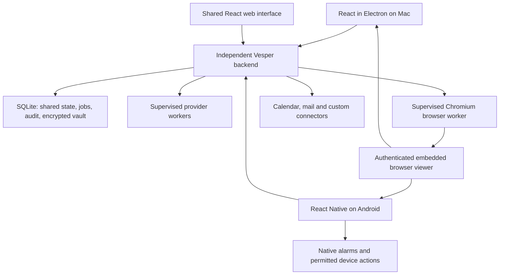

# Final architecture

Vesper is a public, open-source Muse equivalent with interchangeable agent harnesses. The design prioritizes dependable behavior and maintainability, while avoiding unnecessary infrastructure. The product supports an independent shared host so Android and scheduled work can continue when the Mac is off. A Mac-only user can also choose a managed local host with no phone or separate-server setup; this mode pauses work when the Mac is off. A separate process still owns the backend. Mac-Keychain-only storage for the shared vault remains rejected.

This document is the architecture decision. [Code reuse research](architecture-and-reuse.md) records source findings and alternatives, not extra requirements. [Architecture review](architecture-review.md) records three discussions with Claude Opus 5.5. Linear issues describe what users get, not code structure or implementation steps.

## One independently hosted backend

A Node/TypeScript backend runs on an always-on home server or ordinary self-hosted server. Standalone Mac mode runs the same backend in a supervised Electron utility process; it uses local storage and remains loopback-only until explicitly supported remote exposure is implemented. Mac and Android connect to the same workspace. The backend owns chats, goals, schedules, approvals, integration accounts and the encrypted vault. Provider runtimes and browser sessions run beside it as supervised workers, outside UI processes.

The first public release supports one owner and paired devices per deployment. Public release does not require a multi-tenant SaaS. Provide a documented container deployment without a Meta VM platform, Kubernetes, custom relay fleet or always-thinking model.

An available backend does not imply model spending. Models start only for user requests or enabled schedules/event rules. Browser or provider crashes must not take down the API or erase run state.

## Chosen stack

| Concern | Decision |
| --- | --- |
| Desktop/web | React, TypeScript, Vite and Electron for the Mac shell. Share the web/desktop UI, with original Muse-style components. |
| Android | React Native/Expo development builds, native navigation/gestures, and small Kotlin modules for platform functions. Share contracts and logic without forcing DOM components into native UI. |
| Backend | Plain TypeScript on pinned Node LTS. Modules for sessions, actions, connectors, vault and scheduling in one backend, with supervised browser/provider workers. |
| API and live state | tRPC, Zod and TanStack Query. Authenticated HTTP for requests/files and WebSockets for live state/control. Keep media delivery separate and bounded. |
| Storage | SQLite WAL on the authoritative host, migrations and tested backup/restore. No second sync database or CRDT. |
| Scheduling | Croner calculates dates; persistent job/run records own execution state. |
| Browser | Host-owned Chromium through Playwright/CDP, persistent account profiles, and a virtual display when headed compatibility is needed. |
| Browser viewing | Use maintained noVNC components for remote viewing/input instead of inventing a remote desktop client. Embed them in Vesper's browser UI. |
| Providers | Official Claude/OpenCode SDKs, Codex App Server and official ACP for Antigravity, with selected T3 mappings and tests. |
| Cryptography | Standard authenticated encryption from maintained Node crypto or a reviewed library. No custom algorithms or mandatory Mac Keychain. |
| Verification | Vitest, Playwright and native Android tests; signed releases and upgrade/restore checks. |

SQLite is appropriate for a personal workspace with one authoritative writer. If centrally hosted multi-user tenancy becomes a product requirement, reassess Postgres and tenant isolation then. Do not maintain two databases preemptively.

## Sync and availability

Both devices update the same conversations, unread state, goals, schedules, memory, settings, accounts, credential metadata and approvals. Requests carry stable IDs. The host orders changes. Clients reconnect from a cursor or fetch a snapshot when retained history has a gap.

Offline clients initially offer cached reads and local unsent drafts. They do not silently queue approvals or external writes. Retries cannot duplicate messages/jobs. Stale edits refresh or show a conflict instead of silently overwriting newer state.

The Mac can be off while the shared host continues mail/calendar/Canvas checks, browser work and schedules. Tasks requiring the Mac's files/apps wait for it. Phone alarms and already scheduled local reminders can work independently within Android restrictions. Phone actions wait if the phone is offline. Show these distinctions in the UI.

Use established TLS/private-network components and revocable per-device authentication. A public endpoint needs application authentication. Private Tailscale access is an option, not the only installation path. Push notifications carry minimal event references; clients fetch details after authentication.

## One shared encrypted vault

Credentials live in the application's encrypted vault on the shared host. A login added on Android is available to authorized tasks started on either device. Changes and revocation affect the same record. There is no second Mac/Android website-password database and no cookie replication between engines.

Dedicated secure forms submit directly to the trusted backend over the authenticated encrypted connection, bypassing chat/model input. Agent tools use opaque credential IDs. Backend functions check account, destination and approval before filling the browser or calling a connector. Secret values stay out of model-facing results, activity, ordinary logs and client caches. The secure credential-entry request itself intentionally carries the value to the host.

Use a random 256-bit vault key, standard AES-256-GCM per record, fresh nonces, version/key identifiers and authenticated record/origin metadata. The small vault does not need per-item key hierarchies. Rotation must be transactional and recoverable. Missing keys must never cause silent reinitialization over encrypted data.

Unattended operation uses an owner-controlled deployment secret or restricted host key file, separate from database backups and worker mounts. Preserve a passphrase-wrapped recovery copy and verify restoration. Optional locked-after-restart mode pauses credential-dependent work until unlocked. Device-local secure storage may hold a device's own connection token; it is not the shared vault.

The host is trusted and decrypts the vault. Encryption does not protect against a compromised host administrator. Public-release provider workers must not receive vault/key/database directories or unrestricted access to the authenticated browser's debug endpoint. Use standard container/OS boundaries and native harness permission controls, with tests, instead of a bespoke security platform. Keep provider-owned login state with that runtime; do not copy its OAuth tokens to clients.

Backups include consistent database state, encrypted credential data and wrapped recovery material, excluding raw unlock secrets. Treat browser-profile backups separately as sensitive data. Removing a saved password does not sign out a browser automatically; remove-credential and clear-session are distinct actions.

## Shared browser

The host owns Chromium and account-specific profiles. Mac and Android view/control that same session, preserving login continuity without cross-engine cookie sync. Playwright/CDP performs automation; the remote viewer handles user input.

noVNC already supports common keyboard, Unicode clipboard, scaling and mobile touch behavior. Vesper still needs Android IME, file upload/download, viewport and accessibility work. Preserve its MPL and bundled component notices. It is a dependency, not Vesper-authored code.

One controller owns a browser task. User takeover stops agent input; hand-back is explicit. Pause model observations during secure filling. Viewer access is authenticated and short-lived. Never expose VNC/CDP directly to the public. Browser and code workers do not mount the vault. Standard sandboxing stays enabled for untrusted sites.

Validate actual SubItUp, Outlook and Google Messages sign-in persistence and reauthentication. Google API authorization uses the supported external-browser OAuth flow. A site rejection is a real compatibility limit, not permission to bypass it.

Media has its own bounded delivery path so frames cannot delay approval/cancellation. Stop capture when nobody is viewing. A different stream transport can replace noVNC if measured latency/fidelity requires it, without changing browser ownership or app APIs. Do not build several stream stacks before testing the chosen one.

## Providers and context

Vesper owns visible history and outcomes; each harness owns its native session. Normalize start, streaming, tool requests, questions, approvals, resume, cancel and quota/auth errors. Pin tested runtime versions and keep compatibility fixtures.

Use Codex's `app-server generate-ts` for plain TypeScript definitions. T3's generated Effect schemas are not those definitions. Adapt selected T3 stream/error/approval/cancellation behavior with tests and attribution. Use official SDKs rather than recreating their protocol frameworks.

The picker shows harness, account, model and actual capabilities. Switching preserves visible history and selected memory without hidden reasoning or stale approvals. Scheduled jobs pin provider/account/model; paid fallback is never silent.

The selected harness already has an agent loop. Vesper supplies task-scoped tools and concise discovery, not another model planner. Use bounded results, selected memory and cached summaries. Deterministic sync, ranking and scheduling do not invoke an LLM.

Claude's Help Center currently says proposed SDK billing changes were paused and existing plan limits still cover SDK/CLI/third-party usage. Its SDK overview separately discusses permission to offer login in distributed products. Verify supported distribution/authentication rather than claiming a blanket ban or entitlement. The user's installed Claude CLI completed the Opus reviews.

## Durable work and integrations

Persist schedules and attempts. A next-due timer wakes deterministic scheduling code; it is not the source of truth. Handle startup catch-up, timezone changes, true month end and DST. Every run has an explicit cause, limits and recoverable state.

Journal external-write intent, attempt and outcome. A remote send/submit cannot be atomically committed with SQLite. Reconcile uncertain outcomes where possible and otherwise ask before repeating. Use remote IDs/idempotency where available and protect manual calendar edits.

Direct connectors are the primary route where available and permitted. Google Calendar/Gmail use supported APIs and per-account cursors. Canvas prefers permitted institution API access. SubItUp uses Vesper's shared browser because it has no connector. This user's university Outlook account uses the browser; other Outlook accounts use direct Microsoft connectors where permitted. Browser access never overrides an organization's restrictions. Google Messages remains experimental paired-web functionality. The full Muse integration catalog stays in scope with honest availability states.

## T3 reuse

Take host/client separation, contracts, provider lifecycle and permission mappings, account/profile lifecycle tests, reconnect semantics, and worktree/PR/release practices. Browser frame/ack and mobile stream-bridge code are reference/extraction candidates, not a drop-in hosted browser. T3's `ServerSecretStore` provides atomic-file/race-handling ideas, not an encrypted shared-vault implementation.

Do not inherit T3's component picker or its relaxed preview preferences. Translate Electron-specific profile behavior to the chosen host Chromium. Use private Effect packages only if a bounded extraction beats official clients; no mandatory prerelease framework merely to reuse a helper. Record upstream commit, licenses, changes and tests for copied code.

## Public release gates

- Android and scheduled host work continue with the Mac off.
- Add a credential on Android, use it in an authorized shared-browser task, and manage/revoke it from Mac without exposing it in model/activity output.
- Test sync reconnect/gaps, duplicate requests, stale approvals, device revocation and expired auth.
- Test database/vault migrations, interrupted rotation, encrypted backup restore, full disk and crash recovery. Unknown external effects remain visible.
- Killing a browser/provider worker does not lose chats/jobs or crash the API. Retry, resource and token budgets are enforced.
- Current and previous supported clients reconnect, incompatible clients get an update path, and provider upgrades have a tested rollback path.
- Signed/notarized Mac artifacts, signed Android releases and verified update/rollback behavior preserve user data.
- Malicious-page, restricted-worker-access, secret-redaction and authorization tests pass.
- Required Muse screens, animations, accessibility and reduced motion pass on both clients, including a real Nothing Phone check and the month-end calendar journey.

These are release requirements, not claims that software cannot fail. The initial Mac/browser workspace implementation does not satisfy the complete release gates. See the current implementation and evidence limits in `HANDOFF.md` and `docs/development.md`.

## Sources

[T3 pinned source](https://github.com/pingdotgg/t3code/tree/ab099178a7b7f9728843e90fc95ed90bb61d710d), [tRPC transport](https://trpc.io/docs/server/websockets), [Node crypto](https://nodejs.org/docs/latest-v24.x/api/crypto.html), [SQLite backups](https://sqlite.org/backup.html), [Croner](https://croner.56k.guru/), [Playwright container guidance](https://playwright.dev/docs/docker), [noVNC](https://github.com/novnc/noVNC), [Expo modules](https://docs.expo.dev/modules/overview/), and [Claude plan usage](https://support.claude.com/en/articles/15036540-use-the-claude-agent-sdk-with-your-claude-plan).
